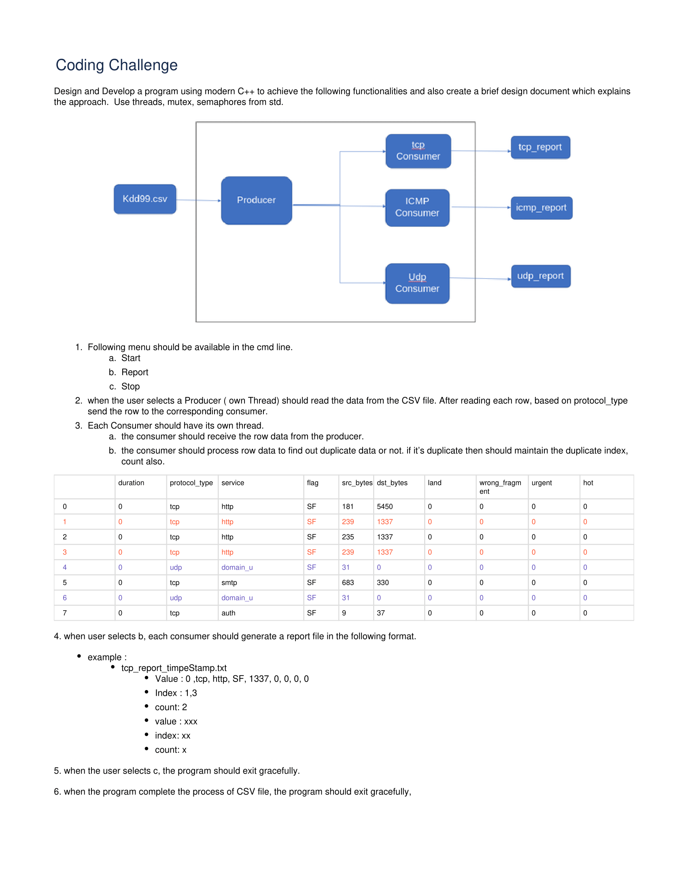

# cyberlens pre-interview task
A pre-interview task for cyberlens. A multi-threaded, c++ packet processing simulation.

# First time running

Clone repo using 
```shell
git clone https://github.com/BarberAlec/cyberlens_pre_interview_task
cd cyberlens_pre_interview_task
```

Make the project with the make command.
```shell
make
```

Run the program with 
```shell
./cyberlens
```

# Documentation
Docs can be found [here](https://barberalec.github.io/cyberlens_pre_interview_task/).

# Project Specifications

